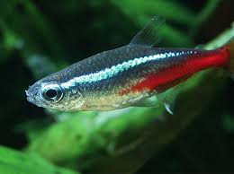
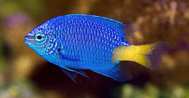

# Day 2 — Responsive Layouts with Flexbox, Grid, and Media Queries (25/11/2025, Tuesday)

## 1. Learning Outcomes
By the end of today, students will be able to:
1. Explain the purpose of responsive web design and why it matters.
2. Recognize how layouts adapt across mobile, tablet, and desktop.
3. Use Flexbox to arrange content in flexible rows/columns.
4. Use CSS Grid to build multi‑column/row layouts (e.g., galleries).
5. Write media queries to optimize styles for small screens.

## 2. Suggested Schedule (60–75 min)
| Time | Segment | Purpose |
|------|---------|---------|
| 0–5  | Recap & Objectives | Connect to Day 1 |
| 5–15 | What is Responsive? | Principles + fluid thinking |
| 15–30| Flexbox Basics | Rows, columns, wrap, alignment |
| 30–45| Grid Basics | Tracks, gaps, auto‑fit/auto‑fill |
| 45–60| Media Queries | Breakpoints + mobile‑first |
| 60–75| Guided Activity | 3‑box, responsive nav, gallery |

## 3. Core Concepts Cheat Sheet
- Fluid Units: Prefer `%`, `vw`, `vh`, `min()`, `max()`, `clamp()` for scalable UI.
- Flexbox: One‑dimensional layout.
  - Container: `display:flex; flex-direction:row|column; flex-wrap:wrap; gap:1rem;`
  - Items: `flex: 1;` (grow), `align-self`, `order`.
- Grid: Two‑dimensional layout.
  - Container: `display:grid; grid-template-columns: repeat(3, 1fr); gap:1rem;`
  - Responsive tracks: `grid-template-columns: repeat(auto-fit, minmax(180px, 1fr));`
- Media Queries (mobile‑first):
  - `@media (max-width: 720px) { /* override for small screens */ }`
  - Start with base mobile styles, then enhance for larger screens (or vice‑versa when needed).

## 3.1 Difference Between Grid and Flex
- **Flexbox** is one-dimensional (either a row OR a column). You control distribution along the main axis and alignment along the cross axis. Item size influences wrapping.
- **Grid** is two-dimensional (rows AND columns). You define an explicit track structure; items can be positioned in both directions without source order changes.

### Flexbox Example (Row that Wraps)
```html
<div class="flex-row">
  <div class="item">1</div>
  <div class="item">2</div>
  <div class="item">3</div>
  <div class="item">4</div>
  <div class="item">5</div>
</div>
```
```css
.flex-row{display:flex;flex-wrap:wrap;gap:.75rem;padding:.5rem;background:#eef}
.flex-row .item{flex:1 1 140px;min-width:140px;padding:1rem;text-align:center;background:#fff;border:1px solid #ccd;border-radius:.5rem}
```
Behavior: Items flow left→right; when space runs out they wrap to the next line. Widths are flexible (`flex:1 1 140px`). No concept of explicit rows; wrapping creates them implicitly.

### Grid Example (Defined Tracks)
```html
<div class="grid-box">
  <div class="cell a">A</div>
  <div class="cell b">B</div>
  <div class="cell c">C</div>
  <div class="cell d">D</div>
</div>
```
```css
.grid-box{display:grid;grid-template-columns:repeat(2,1fr);grid-template-rows:120px 120px;gap:.75rem;padding:.5rem;background:#efe}
.grid-box .cell{display:flex;justify-content:center;align-items:center;font-weight:600;background:#fff;border:1px solid #cdd;border-radius:.5rem}
/* Reposition C to row 1 col 2 */
.grid-box .c{grid-column:2;grid-row:1}
/* Place D spanning two columns */
.grid-box .d{grid-column:1 / -1}
```
Behavior: We explicitly declare 2 columns and 2 rows. Individual items can be moved or stretched across tracks (`.c` repositioned, `.d` spans both columns) without changing HTML order.

| Feature | Flexbox | Grid |
|---------|--------|------|
| Dimension | 1D | 2D |
| Track Definition | Implicit via content | Explicit via templates |
| Reordering / Placement | Mainly source order (can use `order`) | Precise placement with row/column lines |
| Common Use | Nav bars, toolbars, cards row | Page layouts, galleries, dashboards |

Tip: Start with Flexbox when aligning items in a single direction. Choose Grid when you need a matrix-like layout or overlapping/spanning behavior.


## 4. Live Demos
### 4.1 Three Boxes → One Column on Mobile
```html
<section class="cards">
  <article class="card">Box A</article>
  <article class="card">Box B</article>
  <article class="card">Box C</article>
</section>
```
```css
.cards{ display:flex; gap:1rem; }
.card{ flex:1; padding:1rem; border:1px solid #d9e6f2; border-radius:.5rem; background:#fff; }
@media (max-width:720px){
  .cards{ flex-direction:column; }
}
```

### 4.2 Responsive Navigation (Collapses on Small Screens)
```html
<header class="nav">
  <a class="brand" href="#">BlueDepth</a>
  <button id="menuToggle" aria-expanded="false" aria-controls="navLinks">☰</button>
  <nav id="navLinks" class="links">
    <a href="#cards">Layout</a>
    <a href="#gallery">Gallery</a>
    <a href="#contact">Contact</a>
  </nav>
</header>
```
```css
.nav{ display:flex; align-items:center; justify-content:space-between; gap:.5rem; }
.links{ display:flex; gap:.75rem; }
#menuToggle{ display:none; }
@media (max-width:720px){
  #menuToggle{ display:inline-flex; }
  .links{ display:none; flex-direction:column; padding:.5rem 0; }
  .links.open{ display:flex; }
}
```
```js
const btn = document.getElementById('menuToggle');
const links = document.getElementById('navLinks');
btn?.addEventListener('click', ()=>{
  const open = links.classList.toggle('open');
  btn.setAttribute('aria-expanded', String(open));
});
```

### 4.3 Responsive Image Gallery (CSS Grid)
```html
<section id="gallery" class="gallery">
  
  
  
  
  
  
</section>
```
```css
.gallery{ display:grid; gap:.75rem; grid-template-columns: repeat(auto-fit, minmax(160px, 1fr)); }
.gallery img{ width:100%; height:160px; object-fit:cover; border-radius:.5rem; }
@media (min-width:1000px){ .gallery img{ height:200px; } }
```

### 4.4 Media Query Patterns
```css
/* Mobile-first base styles above ... */
@media (min-width: 720px){ /* tablet/desktop enhancements */ }
@media (min-width: 1024px){ /* wide screens */ }
```

## 5. Guided Student Activities
1. Build a 3‑box layout that stacks to 1 column under 720px.
2. Create a responsive navigation that toggles with a button on small screens.
3. Design a responsive gallery using CSS Grid with `auto-fit` + `minmax`.

### Stretch Goals
- Add a second breakpoint (e.g., 1024px) adjusting gaps or columns.
- Animate the nav open/close with a simple CSS transition.
- Add `aspect-ratio` to gallery items for consistent tiles.

## 6. Teaching Notes
- Encourage mobile‑first: start with single column, enhance upward.
- Demonstrate DevTools device toolbar for quick viewport testing.
- Keep images optimized and sized appropriately; use `loading="lazy"` when suitable.

## 7. Quick Reference
- Flex: `flex: 1 1 0` (grow, shrink, basis)
- Grid: `repeat(auto-fit, minmax(180px, 1fr))`
- MQ: `@media (max-width: 720px){ ... }`

## 8. Assessment (Exit Ticket)
1. Flexbox vs Grid — one key difference?
2. What does `minmax(180px, 1fr)` achieve in a grid?
3. What does `@media (max-width: 720px)` target?

## 9. Homework
Create a responsive landing section:
- Hero with heading and a call‑to‑action.
- Two features side‑by‑side on desktop, stacked on mobile.
- A 2‑row image grid that scales on larger screens.
- Include at least one media query to adjust spacing and font sizes.

---
Use `day2-demo.html` and `styles-day2.css` in this folder to try the examples quickly.
